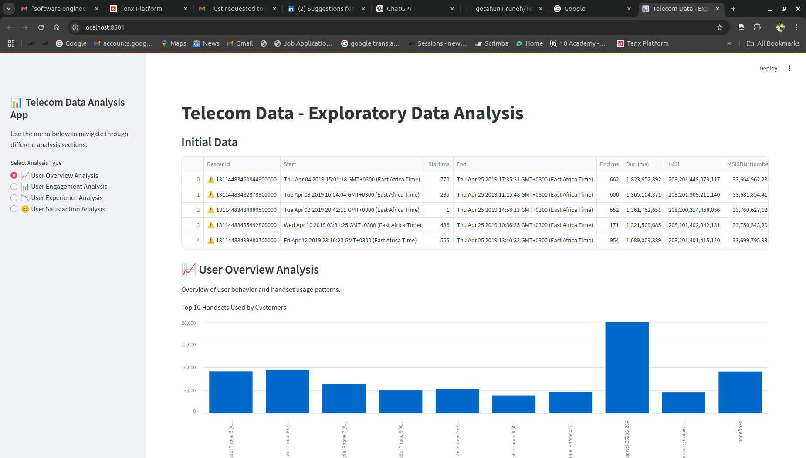
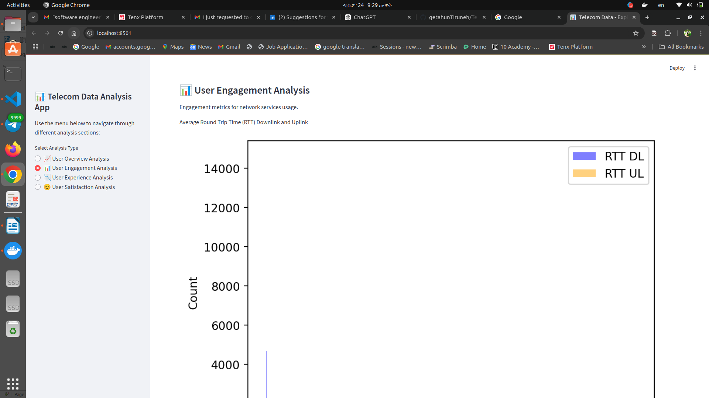
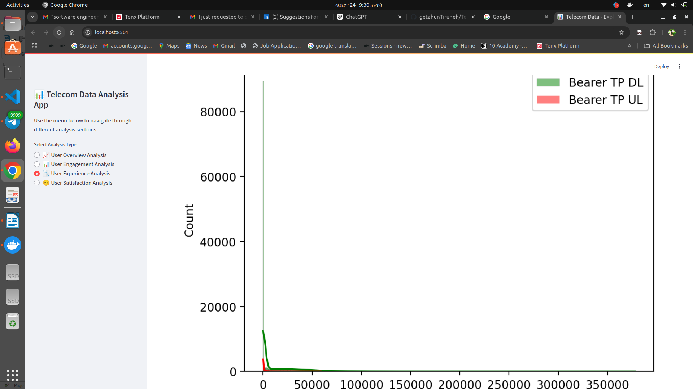
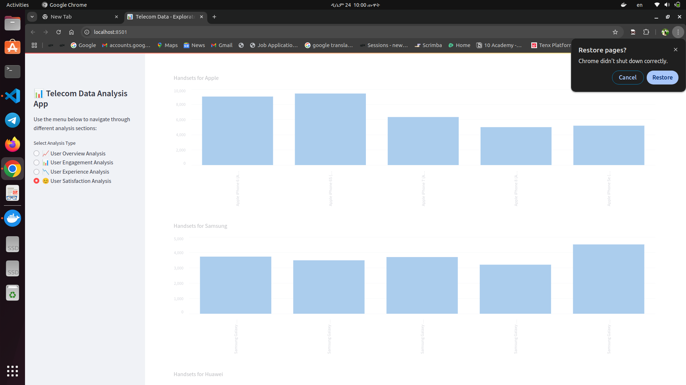

# Telecom User Overview and Engagement Analysis

## Project Overview

This project aims to analyze user behavior and engagement in the telecom sector. By understanding handset popularity, session metrics, and engagement levels, we can provide insights to improve Quality of Service (QoS) and inform marketing strategies.

## Dataset

The dataset includes information on:
- Handset types and manufacturers
- Session duration and frequency
- Data usage (download and upload)

## Analysis Tasks

### Task 1: User Overview Analysis

- **Top 10 Handsets**: Identify the most popular devices among users.
- **Top 3 Manufacturers**: Determine the leading handset manufacturers.
- **Session Duration and Data Usage**: Explore patterns in how users interact with their devices.

### Task 2: User Engagement Analysis

- **Engagement Metrics**: Calculate session frequency, duration, and total traffic to assess user engagement.
- **High Engagement Users**: Identify users with the highest engagement levels.
### Task 3:User Experience Analytics in the Telecommunication Industry
#### Tasks Overview
- **Task 3.1: Aggregate Information per Customer**:Calculate average TCP retransmission, average RTT, average throughput, and identify the handset type for each customer. Handle missing values and outliers by replacing them with the mean (for numeric data) or the mode (for categorical data).
- **Task 3.2: Compute and List 10 of the Top, Bottom, and Most Frequent Values**:Identify the top, bottom, and most frequent values for TCP, RTT, and throughput in the dataset.
- **Task 3.3: Distribution and Average Analysis per Handset Type**:Report the distribution of average throughput and the average TCP retransmission per handset type and provide interpretations based on the findings.
- **Task 3.4: K-Means Clustering**:Perform k-means clustering (with k = 3) on the aggregated experience metrics to segment users into groups of experiences. Provide a brief description of each cluster based on the data.

### Task 4: Customer Satisfaction Analysis and Model Deployment
#### Tasks Overview:
- **Task 4.1: Calculate engagement and experience scores using Euclidean distance.**
- **Task 4.2: Compute the satisfaction score by averaging engagement and experience scores.**
- **Task 4.3: Build a regression model to predict customer satisfaction.**
- **Task 4.4: Perform k-means clustering (k=2) on the scores.**
- **Task 4.5: Aggregate average satisfaction and experience scores per cluster.**
- **Task 4.6: Export the results to MySQL and provide a select query screenshot.**
- **Task 4.7: Deploy the model and track changes using MLFlow or Docker.**

### Task 5: Dashboard Development for Data Insights
#### Tasks Overview: Design and Development:

***Create a dashboard*** with separate pages for each task title (e.g., User Overview Analysis, User Engagement Analysis, Experience Analysis, Satisfaction Analysis).Visualize the relevant data for each task using appropriate plots.
#### User Overview Analysis


#### User Engagement Analysis


#### Experience Analysis,


#### Satisfaction Analysis,


## Key Insights

- **Device Popularity**: Apple devices are the most popular, followed by Huawei and Samsung.
- **User Engagement**: Most users have low session frequencies, with a few highly engaged users showing frequent activity.

## Recommendations

- **Optimize Network Resources**: Focus on areas with high engagement.
- **Targeted Marketing**: Leverage insights on handset popularity and user engagement.
- **Service Bundling**: Consider app usage patterns for bundled offerings.

## How to Run the Analysis

1. Clone the repository.
2. Install required Python packages:
   #### Data Analysis & Visualization Libraries and Database Connectivity & Management Libraries.
    + pandas: A powerful library for data manipulation and analysis for structured data in tabular form (like CSV or SQL tables).
    + numpy:A fundamental library for numerical computing in Python. 
    + seaborn:A data visualization library built on top of Matplotlib, designed for creating visually appealing and informative statistical graphics.
    + matplotlib:The base library for creating static, interactive, and animated visualizations in Python.
    + scikit-learn is a powerful library in Python for machine learning, providing tools for data preprocessing, dimensionality reduction, clustering... 

   #### Database Connectivity & Management Libraries:
    + psycopg2:A PostgreSQL database adapter for Python, used for executing SQL commands and managing transactions with PostgreSQL databases.
    + psycopg2-binary:A precompiled binary version of psycopg2, simplifying installation and avoiding the need to build the library from source.
    + python-dotenv:A library for reading key-value pairs from .env files into environment variables. 
    + sqlalchemy: A comprehensive SQL toolkit and Object-Relational Mapping (ORM) library.
    + mysql-connector-python: A MySQL driver for connecting Python applications to MySQL databases.
   #### Web Application Framework:
    + streamlit: A framework for building interactive and user-friendly web applications directly in Python.
3. Run the analysis scripts in the `notebooks` directory.


```bash
git clone https://github.com/GetieBalew24/TellCo_Telecom_Analysis.git
cd TellCo-Telecom-Analysis
pip install -r requirements.txt
